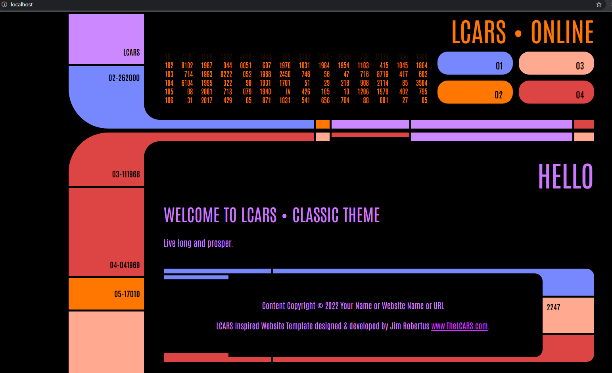

# LCARS UI 

A fun project to convert the lcars project into a Golang hosted project.


## Features

- Something, Something, Something, Dark side...


## Roadmap

- Add dynamic data for lcars interface

- Add Host Metrics to screen

- Kubernetes


## Installation

Install Go / Docker

```bash
    git clone github.com/aetrius/lcars-ui.git
    go get github.com/joho/godotenv
    go install github.com/cosmtrek/air@latest
    go mod vendor
    sudo docker-compose build
    sudo docker-compose up -d
```
    
## Screenshots




## Deployment

To deploy this project run

```bash
  go run .
```


## Acknowledgements

 - [The LCARS](https://www.thelcars.com/)
